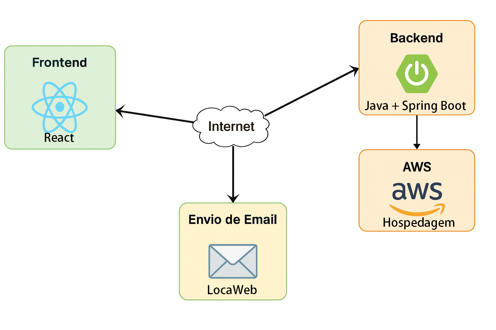
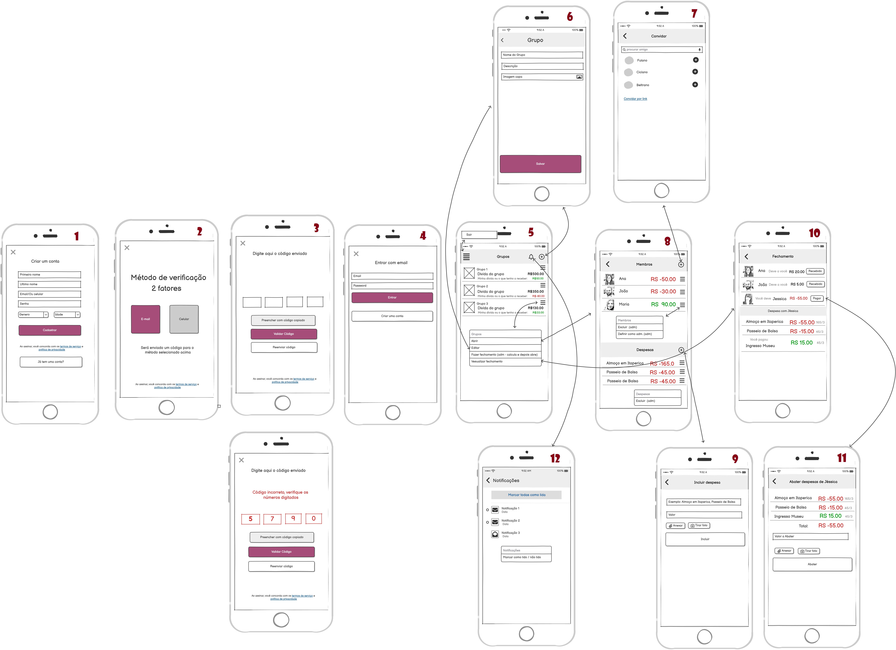
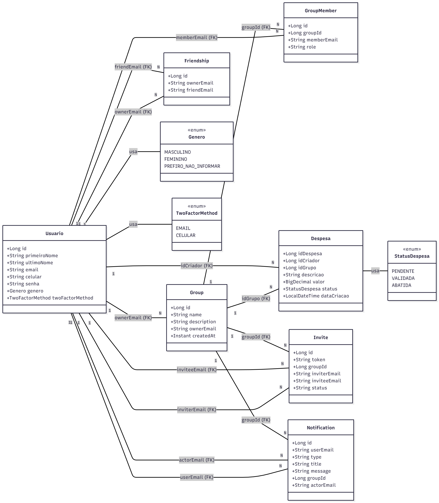
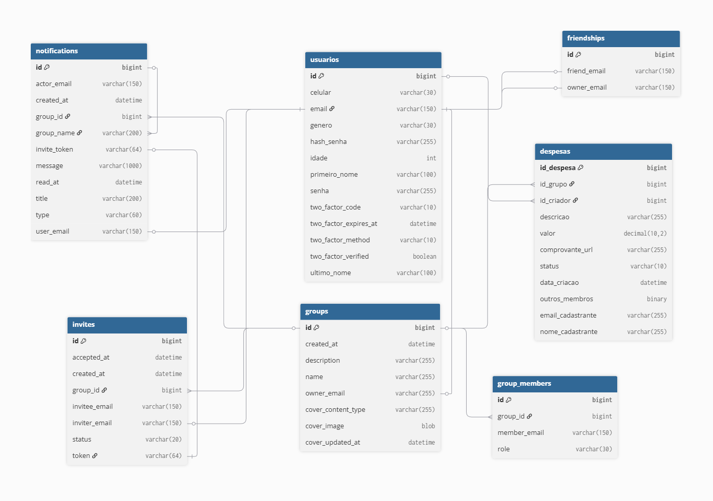
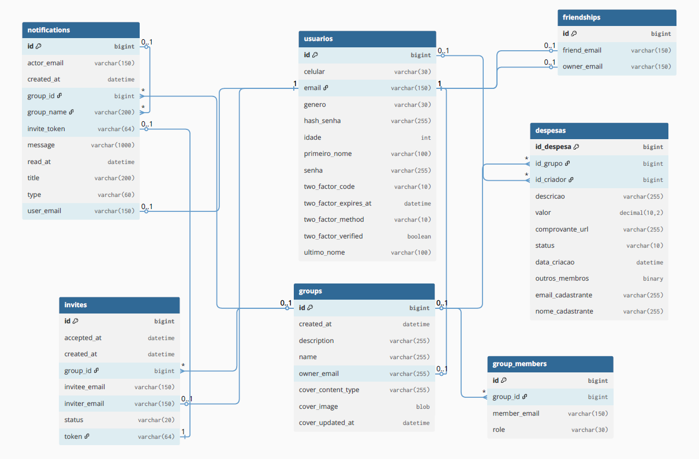

## 4. Projeto da Solução

<span style="color:red">Pré-requisitos: <a href="03-Modelagem do Processo de Negocio.md"> Modelagem do Processo de Negocio</a></span>

## 4.1. Arquitetura da solução

Nossa aplicação é estruturada em uma arquitetura web moderna composta por frontend em React, responsável pela interface e interação com o usuário, e um backend em Spring Boot, que centraliza as regras de negócio, autenticação e serviços internos.
Os dados são persistidos em um banco MySQL, garantindo armazenamento estruturado e consultas eficientes.
Toda a solução é hospedada na AWS, aproveitando sua escalabilidade e confiabilidade.
Além disso, o sistema realiza envio de e-mails para recuperação de senha.




### 4.2. Protótipos de telas

O protótipo desenvolvido representa o fluxo principal de uso do sistema Passa Régua, desde a criação de conta até o fechamento financeiro de um grupo de despesas. Ele foi construído com base nos requisitos levantados na Especificação do Projeto e nas necessidades identificadas nas Histórias de Usuário de Júlia, Pedro, André, Ana e Lucas.

As telas ilustram os caminhos essenciais para:

- criar uma conta;

- autenticar-se no sistema;

- criar e gerenciar grupos;

- registrar e editar despesas;

- visualizar saldos individuais e coletivos;

- efetuar fechamento e acertos financeiros;

- configurar notificações.

### Requisitos Funcionais (RF)
- Fluxo completo de cadastro, autenticação, criação de grupos, registro de despesas e fechamento (RF-001 a RF-011).
- Notificações integradas para pagamentos e eventos críticos (RF-006, RF-009).
- Cálculo automático e transparente do rateio (RF-007, RF-008).

### Requisitos Não Funcionais (RNF)
- Usabilidade e interface intuitiva (RNF-008).
- Responsividade (RNF-001).
- Segurança e validação de identidade (RNF-004).
- Tempo de resposta adequado (RNF-003).

### Histórias de Usuário Atendidas
- **Júlia:** organização dos gastos em tempo real (Telas 8, 9, 10).
- **Pedro:** notificações para lembrar pagamentos (Tela 12).
- **André:** transparência e revisão detalhada (Telas 8 e 10).
- **Ana:** divisão proporcional para participação parcial (Tela 11).
- **Lucas:** saldo individual e controle financeiro (Tela 8).





## Descrição das Telas do Protótipo (1 a 12)

### Tela 1 — Criar Conta
- **Descrição:** Formulário de criação de conta com nome, e-mail, senha e confirmação.
- **Funcionalidades:** Cadastro de usuário, validação, envio de código.
- **Requisitos atendidos:** RF-001, RF-005, RNF-004, RNF-008.

### Tela 2 — Seleção do Método de Verificação (2FA)
- **Descrição:** Escolha entre receber código por e-mail ou celular.
- **Funcionalidades:** Autenticação reforçada, envio de código.
- **Requisitos atendidos:** RF-001, RF-005, RNF-004 (segurança).

### Tela 3 — Digitar Código de Verificação
- **Descrição:** Tela para inserir o código enviado ao usuário.
- **Funcionalidades:** Confirmação de identidade, reenvio de código.
- **Requisitos atendidos:** RF-001, RF-005, RNF-004.

### Tela 4 — Login
- **Descrição:** Entrada no sistema via e-mail e senha.
- **Funcionalidades:** Autenticação, recuperação de senha.
- **Requisitos atendidos:** RF-001, RF-005, RNF-004, RNF-008.

### Tela 5 — Lista de Grupos
- **Descrição:** Exibe os grupos do usuário, valores pendentes e atalhos.
- **Funcionalidades:** Criar grupo, acessar grupos existentes.
- **Requisitos atendidos:** RF-002, RF-010, RF-011, RNF-008.

### Tela 6 — Criar Grupo
- **Descrição:** Formulário para nome, descrição e participantes.
- **Funcionalidades:** Criar e configurar novo grupo.
- **Requisitos atendidos:** RF-002, RF-003, RF-004, RNF-008.

### Tela 7 — Convidar Membros
- **Descrição:** Opções para adicionar participantes (e-mail, link ou contatos).
- **Funcionalidades:** Enviar convite, aceitar/recusar membros.
- **Requisitos atendidos:** RF-003, RF-004, RNF-002.

### Tela 8 — Tela de Saldos / Membros
- **Descrição:** Mostra o saldo individual de cada membro do grupo.
- **Funcionalidades:** Visualizar quem deve, quem tem valor a receber.
- **Requisitos atendidos:** RF-007, RF-008, RF-010, RF-011.

### Tela 9 — Adicionar Despesa
- **Descrição:** Formulário de inclusão de nova despesa.
- **Funcionalidades:** Adicionar valor, categoria, participantes e anexos.
- **Requisitos atendidos:** RF-005, RF-007, RF-008, RNF-008.

### Tela 10 — Fechamento
- **Descrição:** Mostra todas as despesas do grupo contabilizadas.
- **Funcionalidades:** Visualizar totais, analisar gastos, preparar acerto final.
- **Requisitos atendidos:** RF-007, RF-008, RF-010, RF-011.

### Tela 11 — Ajustar Despesa / Rateio
- **Descrição:** Permite editar participantes, valores e divisão da despesa.
- **Funcionalidades:** Rateio proporcional, edição detalhada.
- **Requisitos atendidos:** RF-005, RF-007, RF-008.

### Tela 12 — Notificações
- **Descrição:** Aba com alertas de pagamento, confirmação e atualizações.
- **Funcionalidades:** Gerenciar avisos, histórico de notificações.
- **Requisitos atendidos:** RF-006, RF-009, RNF-006.


## Diagrama de Classes

O diagrama de classes representa o núcleo do domínio do Passa Régua.
Usuario é a entidade central e se relaciona com Group (dono do grupo), GroupMember (participação em grupos), Despesa (criador da despesa), Friendship (rede de amigos), Invite (convites enviados/recebidos) e Notification (avisos relacionados a grupos e despesas).
Group agrega membros, despesas, convites e notificações. As enums Genero, TwoFactorMethod e StatusDespesa modelam, respectivamente, o perfil do usuário, o método de verificação em duas etapas e o estado de cada despesa.




### 4.3. Modelo de dados

O desenvolvimento da solução proposta requer a existência de bases de dados que permitam efetuar os cadastros de dados e controles associados aos processos identificados, assim como recuperações.
Utilizando a notação do DER (Diagrama Entidade e Relacionamento), elaborem um modelo, na ferramenta visual indicada na disciplina, que contemple todas as entidades e atributos associados às atividades dos processos identificados. Deve ser gerado um único DER que suporte todos os processos escolhidos, visando, assim, uma base de dados integrada. O modelo deve contemplar, também, o controle de acesso de usuários (partes interessadas dos processos) de acordo com os papéis definidos nos modelos do processo de negócio.
_Apresente o modelo de dados por meio de um modelo relacional que contemple todos os conceitos e atributos apresentados na modelagem dos processos._

#### 4.3.1 Modelo ER




#### 4.3.2 Esquema Relacional




[Diagrama Relacional no dbdocs](https://dbdocs.io/nayaraferreiraj2/Passa-Regua-Relacional?view=relationships)

---


#### 4.3.3 Modelo Físico

```

CREATE TABLE `usuarios` (
  `id` bigint PRIMARY KEY AUTO_INCREMENT,
  `celular` varchar(30),
  `email` varchar(150) UNIQUE,
  `genero` varchar(30),
  `hash_senha` varchar(255),
  `idade` int,
  `primeiro_nome` varchar(100),
  `senha` varchar(255),
  `two_factor_code` varchar(10),
  `two_factor_expires_at` datetime,
  `two_factor_method` varchar(10),
  `two_factor_verified` boolean,
  `ultimo_nome` varchar(100)
);

CREATE TABLE `groups` (
  `id` bigint PRIMARY KEY AUTO_INCREMENT,
  `created_at` datetime,
  `description` varchar(255),
  `name` varchar(255),
  `owner_email` varchar(255),
  `cover_content_type` varchar(255),
  `cover_image` blob,
  `cover_updated_at` datetime
);

CREATE TABLE `group_members` (
  `id` bigint PRIMARY KEY AUTO_INCREMENT,
  `group_id` bigint,
  `member_email` varchar(150),
  `role` varchar(30)
);

CREATE TABLE `friendships` (
  `id` bigint PRIMARY KEY AUTO_INCREMENT,
  `friend_email` varchar(150),
  `owner_email` varchar(150)
);

CREATE TABLE `invites` (
  `id` bigint PRIMARY KEY AUTO_INCREMENT,
  `accepted_at` datetime,
  `created_at` datetime,
  `group_id` bigint,
  `invitee_email` varchar(150),
  `inviter_email` varchar(150),
  `status` varchar(20),
  `token` varchar(64) UNIQUE
);

CREATE TABLE `notifications` (
  `id` bigint PRIMARY KEY AUTO_INCREMENT,
  `actor_email` varchar(150),
  `created_at` datetime,
  `group_id` bigint,
  `group_name` varchar(200),
  `invite_token` varchar(64),
  `message` varchar(1000),
  `read_at` datetime,
  `title` varchar(200),
  `type` varchar(60),
  `user_email` varchar(150)
);

CREATE TABLE `despesas` (
  `id_despesa` bigint PRIMARY KEY AUTO_INCREMENT,
  `id_grupo` bigint,
  `id_criador` bigint,
  `descricao` varchar(255),
  `valor` decimal(10,2),
  `comprovante_url` varchar(255),
  `status` varchar(10),
  `data_criacao` datetime,
  `outros_membros` binary,
  `email_cadastrante` varchar(255),
  `nome_cadastrante` varchar(255)
);

ALTER TABLE `despesas` ADD FOREIGN KEY (`id_criador`) REFERENCES `usuarios` (`id`);

ALTER TABLE `despesas` ADD FOREIGN KEY (`id_grupo`) REFERENCES `groups` (`id`);

ALTER TABLE `usuarios` ADD FOREIGN KEY (`email`) REFERENCES `groups` (`owner_email`);

ALTER TABLE `group_members` ADD FOREIGN KEY (`group_id`) REFERENCES `groups` (`id`);

ALTER TABLE `usuarios` ADD FOREIGN KEY (`email`) REFERENCES `friendships` (`owner_email`);

ALTER TABLE `usuarios` ADD FOREIGN KEY (`email`) REFERENCES `friendships` (`friend_email`);

ALTER TABLE `invites` ADD FOREIGN KEY (`group_id`) REFERENCES `groups` (`id`);

ALTER TABLE `usuarios` ADD FOREIGN KEY (`email`) REFERENCES `invites` (`inviter_email`);

ALTER TABLE `notifications` ADD FOREIGN KEY (`group_id`) REFERENCES `groups` (`id`);

ALTER TABLE `usuarios` ADD FOREIGN KEY (`email`) REFERENCES `notifications` (`user_email`);

ALTER TABLE `invites` ADD FOREIGN KEY (`token`) REFERENCES `notifications` (`invite_token`);

ALTER TABLE `notifications` ADD FOREIGN KEY (`group_name`) REFERENCES `notifications` (`id`);


```


### 4.4. Tecnologias

As principais tecnologias utilizadas na solução são o React no front-end, responsável pela construção da interface web responsiva e dinâmica, e o Spring Boot no back-end, utilizado para implementar os serviços, regras de negócio e endpoints REST que serão consumidos pelo frontend. O MySQL é adotado como sistema gerenciador de banco de dados (SGBD), armazenando de forma estruturada as informações de usuários, registros e demais dados do sistema.

Para disponibilizar a aplicação em produção, utilizamos a AWS para hospedagem e deploy, garantindo escalabilidade e alta disponibilidade da solução. O envio de e-mails é realizado a partir do back-end Java, utilizando bibliotecas de integração de e-mail (por exemplo, módulos de envio SMTP do próprio Spring), permitindo notificações automáticas e comunicação com os usuários.

Como ferramentas de apoio ao desenvolvimento, são utilizados Node.js e npm para gerenciamento de dependências do React, IDE de desenvolvimento (como Visual Studio Code e/ou IntelliJ IDEA) para codificação, além de Git e GitHub para versionamento e colaboração entre os membros da equipe.

| **Dimensão**   | **Tecnologia**  |
| ---            | ---             |
| SGBD           | MySQL           |
| Front end      | React           |
| Back end       | Java SpringBoot |
| Deploy         | AWS             |

