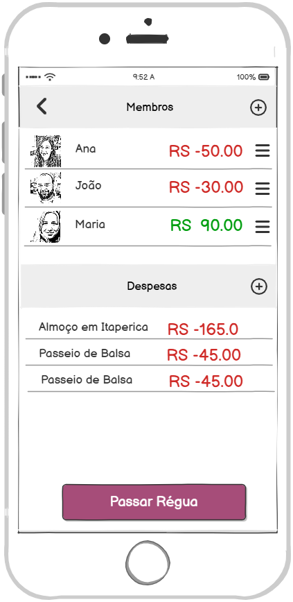

### 3.3.2 Processo 2 – Gerênciamento de grupos

#### Descrição

O processo de gerenciamento de grupos constitui o processo principal da aplicação, pois é nele que se concentram todas as interações relacionadas à criação, manutenção e organização dos grupos. É o ponto de entrada para o usuário acompanhar e administrar suas participações, funcionando como a base sobre a qual os demais processos se conectam.

Possui as raias definindo as responsabilidades do sistema, usuário comum e administrador.

Possui as atividades de usuário
- 1 - Visualizar grupo
- 2 - Criar novo grupo ou editar um grupo existente
- 3 - Abrir um grupo onde é possivel gerenciar os membros e as depesas do grupo
- 4 - Visualizar notificação que é onde concentra todas as notificações que o sistema irá emitir.

Possui os subprocessos
- Gerenciar Membros (processo 3)
- Gerenciar Despesas (processo 4)
- Gerenciar Fechamento e Abatimentos (processo 5)

#### Modelagem

#### Detalhamento das atividades

**Atividade 1. Visualizar grupos**

| **Comandos**         | **Destino**                  | **Tipo** |
| ---                  | ---                          | ---      |
| Criar +              | 2. Criar novo grupo / Editar |          |
| Editar               | 2. Criar novo grupo / Editar |          |
| Abrir                | 3. Abrir grupo               |          |
| Fazer fechamento     | Calcular e 4. Visualizar fechamento     |          | 
| Visualizar fechamento| 4. Visualizar fechamento     |          |
| Visualizar noficações| 5. Visualizar notificações   |          |
| Sair                 |  Sair da aplicação           |          |

---

**Atividade 2. Criar novo grupo / Editar**

| **Campo**       | **Tipo**        | **Restrições**                | **Valor default** |
| ---             | ---             | ---                           | ---               |
| Nome do Grupo   | Caixa de texto  | obrigatório; 3–60 caracteres  |                   |
| Descrição       | Área de texto   | até 500 caracteres            |                   |
|

| **Comandos**  | **Destino**                 | **Tipo** |
| ---           | ---                         | ---      |
| Salvar        | 1. Visualizar grupos | default  |
| Voltar <      | 1. Visualizar grupos | cancel   |

---

**Atividade 3. Abrir grupo**

| **Comandos**             | **Destino**                   | **Tipo**   |
| ---                      | ---                           | ---        |
| Voltar <                 | 1. Visualizar grupos          | cancel     |

Os demais comandos dessa tela estão nos processos (3 - Gerenciar membros) e (4 - Gerenciar despesas)

---

**Atividade 4. Visualizar notificações**

| **Comandos**               | **Destino**                   | **Tipo**   |
| ---                        | ---                           | ---        |
| Marcar todas como lido     | Nenhum                        |            |
| Marca como lido / Não lido | Nenhum                        |            |
| Voltar <                   | 1. Visualizar grupos          | cancel     |

---

#### Wireframes
  
| **Atividade 1**|  **Atividade 2** |  
| ---            | ---              |
|  |  |

| **Atividade 3**|  **Atividade 4** |  
| ---            | ---              | 
|   |  |                                                           
