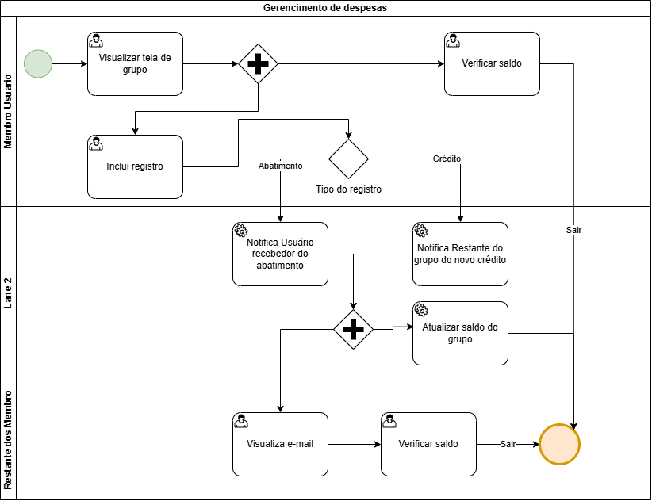
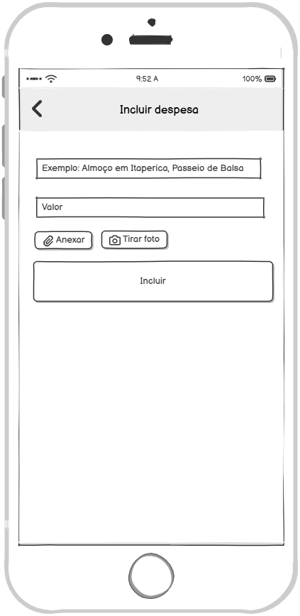
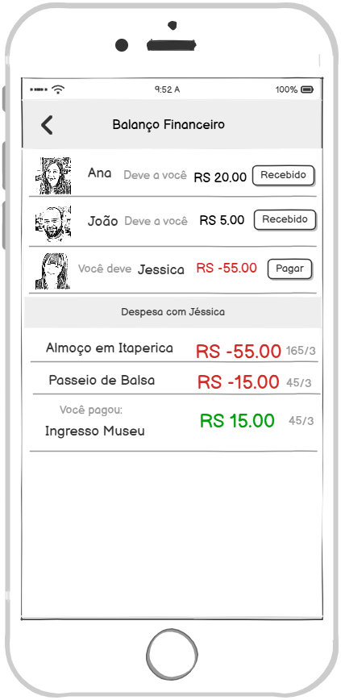
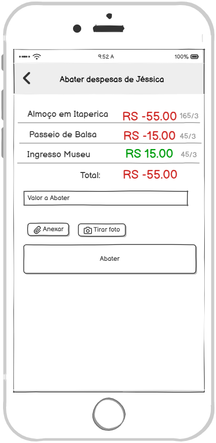

### 3.3.4 Processo 4 – Gerenciamento de Despesas

#### Descrição

O processo de **Gerenciamento de Despesas** tem início quando o usuário acessa e visualiza o grupo ao qual pertence.
A partir daí, ele pode **incluir novas despesas, consultar lançamentos existentes, validar valores registrados por outros participantes e realizar abatimentos conforme os pagamentos são efetuados**.
O processo é finalizado quando **os membros do grupo recebem um e-mail notificando a criação da despesa ou do abatimento**, o que assegura centralização, transparência e rastreabilidade das informações financeiras, além de reduzir conflitos e simplificar a divisão dos gastos.

#### Modelagem

---

#### Detalhamento das atividades

---

**Atividade 4.1 – Incluir Despesa**

| **Campo**        | **Tipo**       | **Restrições**                 | **Valor default** |
|------------------|----------------|--------------------------------|-------------------|
| Descrição        | Caixa de Texto | Obrigatório, texto simples      | Exemplo: “Almoço em Itaparica” |
| Valor            | Número         | Obrigatório, > 0                |                   |
| Anexar comprovante | Arquivo/Imagem | Opcional                        |                   |

| **Comando**  | **Destino**         | **Tipo**  |
|--------------|---------------------|-----------|
| Incluir      | Visualizar Grupo    | default   |

---

**Atividade 4.2 – Visualizar Grupo**

| **Campo**     | **Tipo**  | **Restrições** | **Valor default** |
|---------------|-----------|----------------|-------------------|
| Lista membros | Tabela    | Exibe todos os membros com saldo calculado |   |
| Lista despesas| Tabela    | Exibe todas as despesas registradas        |   |

| **Comando**   | **Destino**               | **Tipo**  |
|---------------|---------------------------|-----------|
| + (Adicionar) | Incluir Despesa           | default   |
| Selecionar membro | Visualizar Fechamento | default   |

---

**Atividade 4.3 – Visualizar Fechamento**

| **Campo**          | **Tipo** | **Restrições** | **Valor default** |
|--------------------|----------|----------------|-------------------|
| Lista de saldos    | Tabela   | Automático (saldos calculados) | |
| Histórico despesas | Tabela   | Exibe despesas relacionadas ao membro selecionado | |

| **Comando**   | **Destino**          | **Tipo**  |
|---------------|----------------------|-----------|
| Pagar         | Abater Despesa       | default   |
| Recebido      | Confirma pagamento   | default   |

---

**Atividade 4.4 – Abater Despesa**

| **Campo**          | **Tipo**       | **Restrições**                 | **Valor default** |
|--------------------|----------------|--------------------------------|-------------------|
| Valor a abater     | Número         | Obrigatório, > 0, ≤ saldo devido |                 |
| Anexar comprovante | Arquivo/Imagem | Opcional                        |                   |

| **Comando**   | **Destino**         | **Tipo**  |
|---------------|---------------------|-----------|
| Abater        | Visualizar Fechamento | default |

---

#### Wireframes

---

##### Atividade 4.1 – Incluir Despesa

**Descrição:** Tela destinada ao registro de uma nova despesa, permitindo inserir valores, descrição e anexar comprovantes.  

  

**Requisitos Atendidos:**
- **RF-005**: Permite registrar despesas com anexos.  
- **RNF-008**: A interface é simples e direta, adequada a usuários não técnicos.  

---

##### Atividade 4.2 – Visualizar Grupo

**Descrição:** Tela que centraliza a visualização do grupo, exibindo membros, despesas lançadas e saldo de cada participante.  

  

**Requisitos Atendidos:**
- **RF-002**: Permite gerenciamento de grupos de despesas.  
- **RF-007**: Mostra a divisão automática das despesas entre os membros.  
- **RF-010**: Oferece visualização clara da carteira coletiva e individual.  

---

##### Atividade 4.3 – Visualizar Balanço Financeiro

**Descrição:** Tela que mostra o balanço das contas, incluindo saldos individuais, histórico de despesas e botões de ação para pagamento ou confirmação.  

  

**Requisitos Atendidos:**
- **RF-008**: Registra pagamentos e abatimentos com atualização de saldos.  
- **RF-009**: Confirmações de pagamento são notificadas aos membros.  
- **RF-010**: Exibe a carteira individual de cada usuário.  
- **RNF-007**: Mantém rastreabilidade via logs de transações.  

---

##### Atividade 4.4 – Abater Despesa

**Descrição:** Tela que permite registrar abatimento de valores devidos, com opção de anexar comprovantes.  

  

**Requisitos Atendidos:**
- **RF-008**: Permite o registro de pagamentos e abatimentos.  
- **RF-009**: Envia notificações de confirmação de pagamento.  
- **RNF-006**: Sistema tolerante a falhas, com mensagens de erro claras.  
