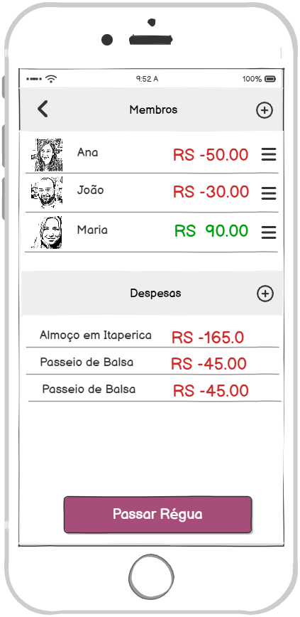
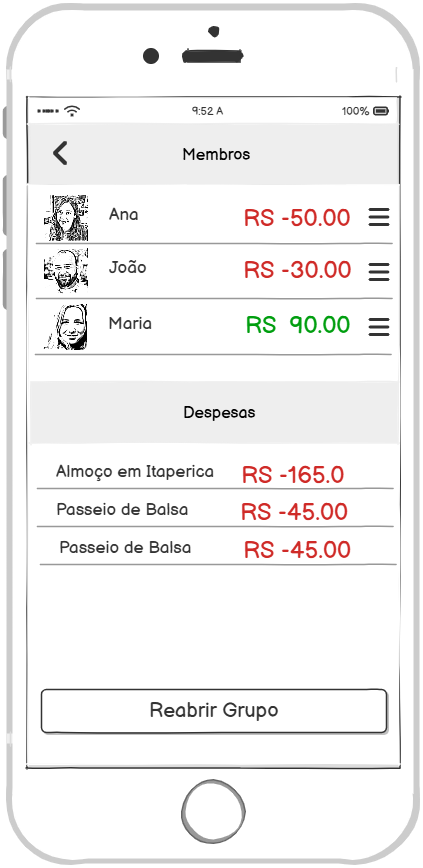

### 3.3.5 Processo 5 – Abatimento de pagamento

O **fechamento financeiro** tem início quando o usuário acessa o grupo ao qual pertence e visualiza suas informações financeiras. A partir desse momento, ele pode clicar no botão **Fechar**, o que bloqueia automaticamente a criação de novas despesas e o registro de novos abatimentos entre os participantes.

O fechamento pode ser realizado se houver algum membro com débitos pendentes no grupo, porém é necessário confirmação. Qualquer usuário , **desde de que membro do grupo**, tem permissão para **reabrir** o grupo, caso seja necessário.

Após a conclusão do processo, todos os membros recebem uma **notificação** informando o encerramento. A partir desse momento, não é mais possível adicionar novos registros financeiros, sejam eles despesas ou abatimentos.

### Mapeamento dos Wireframes com os Requisitos
A seguir, apresentamos a descrição de como os wireframes apresentados atendem aos requisitos funcionais e não funcionais do sistema.

5. Fechamento do grupo (Passando a régua)

#### Detalhamento das Atividades

A seguir, descrevemos as propriedades das atividades do **processo de fechamento financeiro**, relacionando-as aos campos de dados do wireframe.

1. **Acessar grupo financeiro**  
   - **Descrição:** O usuário acessa o grupo ao qual pertence para visualizar as informações de despesas e abatimentos antes do fechamento.  
   - **Campos utilizados:**  
     - *Identificação do grupo* → nome ou código do grupo.  
     - *Lista de despesas* → registros financeiros existentes. 

2. **Executar fechamento financeiro**  
   - **Descrição:** O usuário clica no botão **Passar Régua**, bloqueando a criação de novas despesas e abatimentos entre os participantes.  
   - **Campos utilizados:**  
     - *Botão de ação* → **Passar Régua**.  .  
     - *Status do grupo* → atualizado automaticamente para “Fechado”.  

3. **Notificar membros do grupo**  
   - **Descrição:** Após o fechamento, o sistema envia uma notificação a todos os membros, informando que o grupo foi encerrado e que não é mais possível adicionar novos registros financeiros.  
   - **Campos utilizados:**  
     - *Caixa de texto* → conteúdo da notificação.  
     - *Data e Hora* → momento do envio da notificação.  
     - *Lista de destinatários* → todos os membros do grupo.  

4. **Reabrir grupo (opcional)**  
   - **Descrição:** Caso seja necessário, qualquer **membro do grupo** pode reabrir o grupo para permitir novos lançamentos de despesas ou abatimentos.  
   - **Campos utilizados:**  
     - *Botão de ação* → **Reabrir grupo**.  
     - *Validação de permissão* → somente **membros do grupo** pode executar esta ação.  
     - *Status do grupo* → atualizado automaticamente para “Aberto”.  

---

**Atividade: Fechamento Financeiro do Grupo**

| **Campo**              | **Tipo**        | **Restrições**                                         | **Valor default** |
|-------------------------|-----------------|--------------------------------------------------------|-------------------|
| Status do grupo         | Seleção única   | “Aberto” ou “Fechado”                                 | Aberto            |
| Verificação de débitos  | Lógica interna  | Pode estar com débitos para permitir fechamento        | -                 |
| Notificação enviada     | Caixa de Texto  | Automática, com mensagem de encerramento               | “Grupo fechado”   |
| Data/Hora do fechamento | Data e Hora     | Registrado automaticamente pelo sistema                | Data/Hora atual   |

| **Comandos**       | **Destino**                          | **Tipo**   |
|--------------------|--------------------------------------|------------|
| Passar Régua       | Atualizar status e travar registros  | default    |
| Reabrir grupo      | Restaurar status e liberar registros | default    |
| Enviar notificação | Notificar todos os membros           | automático |
